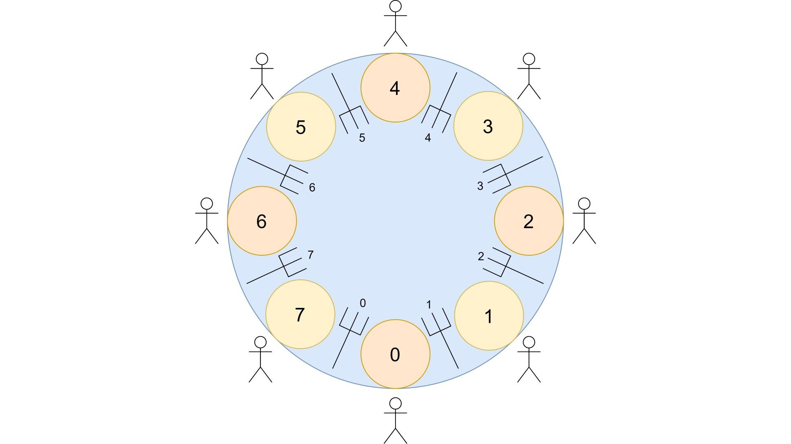

# philo
## Comprendre les threads



## Principe

L'objectif de ce projet est de résoudre le "Dining Philosophers Problem", un classique sur le partage des ressources en informatique système. Les règles sont simples : 
Un nombre *n* de philosophes assis autour d'une table, une fourchette entre chacun et un plat de spaghettis au centre. Chaque philo a besoin de manger, mais doit pour cela se servir des fourchettes à sa gauche et à sa droite. Ils ne peuvent logiquement pas tous manger en même temps, mais attention ! Passé un certain délai sans manger, un philo peut mourir de faim. Après manger, le philo dort, puis se mets à penser jusqu'a pouvoir manger à nouveau.

Pour executer :
```bash
$> make
$> ./philo 5 800 200 150 7
```
> Où :
>
>   5 -> nombre de philosophes
>
>   800 -> temps (ms) qu'un philo mets pour mourir
>
>   200 -> temps (ms) qu'un philo mets pour manger
>
>   150 -> temps (ms) qu'un philo mets pour dormir
>
>   7 -> nombre minimum de repas mangés avant de finir la simulation (optionnel)

## Fonctionnement

Definition des threads.
Il m'a semblé logique d'utiliser une liste chaînée circulaire, où le dernier élément pointerais donc sur le premier.
Explication des mutex
Eviter deadlocks, jauger le temps de déclenchement des threads

## Difficultés rencontrées

:construction_worker_man: En travaux :construction_worker_woman:

## Documentation utilisée

:construction_worker_man: En travaux :construction_worker_woman:


