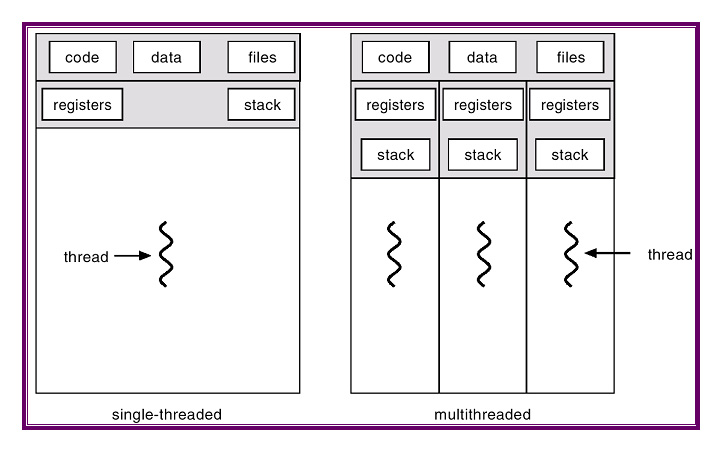

# philo
## Comprendre les threads


## Principe

L'objectif de ce projet est de résoudre le "Dining Philosophers Problem", un classique sur le partage des ressources en informatique système. Les règles sont simples : 
Un nombre *n* de philosophes assis autour d'une table, une fourchette entre chacun et un plat de spaghettis au centre. Chaque philo a besoin de manger, mais doit pour cela se servir des fourchettes à sa gauche et à sa droite. Ils ne peuvent logiquement pas tous manger en même temps, mais attention ! Passé un certain délai sans manger, un philo peut mourir de faim. Après manger, le philo dort, puis se mets à penser jusqu'a pouvoir manger à nouveau.

Pour executer :
```bash
$> make
$> ./philo 5 800 200 150 7
```
> Où :
>
>   5 -> nombre de philosophes
>
>   800 -> temps (ms) qu'un philo mets pour mourir
>
>   200 -> temps (ms) qu'un philo mets pour manger
>
>   150 -> temps (ms) qu'un philo mets pour dormir
>
>   7 -> nombre minimum de repas mangés avant de finir la simulation (optionnel)

## Fonctionnement

### Qu'est-ce qu'un thread ?
Un thread est un suite d'instruction executée indépendamment des autres threads. En clair, cela permet d'executer différentes opérations en parallèle ou en concurrence au sein d'un même processus. Pour la définition des processus, voir mon projet [pipex](https://github.com/ArnoChansarel/pipex). Mais de ce que j'ai pu comprendre, la parallèlisme pur ne peut exister au sein d'un processeur (pour l'exemple, un processeur 1 coeur). En effet, ce dernier ne peut effectuer qu'une tache à la fois, comme un humain porterai rapidement et succesivement son attention sur deux actions qu'il effectuerais en même temps. Nous reviendrons dessus en parlant de la focntion **usleep()**. 

Etant donné que les threads partagent le même espace mémoire alloué au processus, ils partagent ainsi les mêmes variables et structures de données. Contrairement aux processus, ils communiquent donc entre eux, ce qui servira un but différent. Cependant, cette possibilité vient avec certains problèmes dont il faudra proteger notre programme :
Le probleme des [datarace](https://www.youtube.com/watch?v=FY9livorrJI&list=PLfqABt5AS4FmuQf70psXrsMLEDQXNkLq2&index=3) survient lorsque plusieurs threads cherchent à acceder simultanément une même variable. Il convient alors de protéger ces dernières avec un système de **mutex** pour éviter des conflits.



Un mutex est une structure de données qui agi sur la variable comme un verrou. Lorsqu'un thread lock un mutex sur une variable, il s'en réserve l'accès jusqu'à l'avoir dévérouillée. Pendant ce temps, si un autre thread cherche à y accéder, il devra attendre patiemment que la variable soit accessible. Une bonne utilisation des mutex va donc permettre de gérer une grande partie des problèmes de ce projet.
On verra que j'utilise aussi des variables atomiques (notées _Atomic). Ces variables vont fonctionner sur le même principe que si elles étaient protégées par un mutex, c'est a dire qu'une opération est garantie d'être effectuée dans son intégralité sans qu'un autre thread vienne y avoir accès. Ces variables atomiques sont plus faciles à utiliser que les mutex surtout dans le cas de petites opérations. Il aurait été possible pour ce projet de se passer de mutex, mais pour les besoins d'apprentissage nous utiliserons les deux.

### Architecture
La structure t_data contient les informations envoyées par l'utilisateur, ainsi qu'un tableau de mutex qui représentent les fourchettes des philosophes.


Puisque chaque philosophe doit être représenté par un thread, il m'a semblé logique de les créer à partir d'une structure unique et les manipuler grâçe à une liste chaînée circulaire, ou chaque élément contiendrait des pointeur sur la structure générale t_data, incluant un pointeur sur le tableau de mutex. Ainsi, si un philosophe cherche à manger, il verouillera d'abord sa propre fourchette, et ensuite seulement celle de l'élément suivant.


Une simple boucle permet de lancer chaque thread les uns à la suite des autres à travers la fonction pthread_create(). Elle prend en argument la fonction routine() en tant que set d'instruction qui fera vivre le thread. routine() comprend une boucle d'action [manger->dormir->penser] qui ne sera stoppée que par la fonction monitoring().
Cette dernière travaille en parallèle de nos threads et va simplement vérifier qu'aucun philosophe ne meurt, auquel cas elle arrêtera l'ensemble des threads en accèdant à la variable atomique *death*.

## Difficultés rencontrées
### Gestion des erreurs
Il est assez difficile d'apréhender ses erreurs sur ce projet, étant donné qu'un classique deboguage à base de printf() est impossible du fait de sa nature, ce qui peut être un peu frustrant. Il faut donc bien comprendre les différentes notions pour situer ses erreurs. Pour situer une erreur sur ce projet, le plus simple pour moi était de réduire le projet au plus simple en commentant une grande partie (par exemple garder seulement l'action de penser dans routine()) et décommentant progressivement chaque ligne en notant soigneusement les changements occasionés jusqu'à reperer notre erreur.

### la fonction usleep
Il m'a fallu du temps avant de comprendre que la fonction **usleep()** pouvait causer un décalage/imprécisison du temps de suspension du thread, ce qui me causait toujours des inexactitudes dans le déroulement du processus, surtout avec un nombre plus important de threads. Pour pallier à ça, la fonction usleep_custom() va découper l'action d'usleep en une somme d'appels à **usleep()**, permettant d'augmenter grandement la précision du temps de suspension demandé.

## Documentation utilisée

[CodeVault nous explique tout !](https://www.youtube.com/playlist?list=PLfqABt5AS4FmuQf70psXrsMLEDQXNkLq2)


